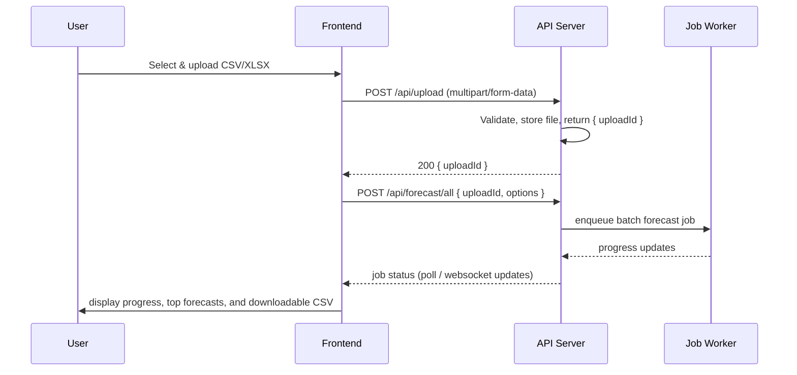

# Grand Forecaster — Detailed Documentation

This repository is a production-ready React + TypeScript sales forecasting dashboard with a cinematic UI and a clean, modular architecture. The documentation below explains the project's structure, development workflow, API contract, configuration, and contribution guidelines so you can run, extend, or connect the app to a backend.

This README is organized to be both a quick-start guide and an in-depth reference for maintainers.

## Table of Contents

- Project overview
- Quick start
- Project layout and key modules
- Development workflow
- API contract and backend integration
- Configuration & environment variables
- Mock mode & demo data
- Testing
- Build & deployment
- Troubleshooting & common issues
- Contributing
- License

---

## Project overview

Grand Forecaster is a UI-first forecasting dashboard focused on making sales forecasts and visual insights accessible. Key features include:

- Batch forecasting for uploaded datasets
- Per-article historical analysis and ensemble forecasts
- Interactive dashboard with trend metrics, charts, and export options

The project emphasizes Clean Architecture: domain logic is isolated from UI and infrastructure to make the codebase easier to test, extend, and replace parts.

## Quick start

Prerequisites

- Node.js 18+ and npm (or pnpm/bun if you prefer; package.json scripts assume npm)

Install and run (development)

1. Install dependencies:

```bash
npm install
```

2. Start dev server (Vite):

```bash
npm run dev
```

3. Open http://localhost:3000/ (Vite will print the exact URL)

Build for production and preview

```bash
npm run build
npm run preview
```

Note: If your environment uses a different package manager adjust commands accordingly (pnpm install, bun install, etc.).

## Project layout and key modules

Top-level overview (abridged for readability):

src/
- components/      — Reusable React components and UI primitives
- domain/          — Business logic, types, and helpers (trend calculations, entities)
- infrastructure/  — API client, data adapters, and mock data generation
- pages/           — Feature pages wired into the app routes
- store/           — Global UI state (Zustand)
- hooks/           — Custom React hooks
- utils/           — Small utility helpers

Important files and purpose

- `src/infrastructure/apiClient.ts` — Abstraction over the backend; used by front-end services. When VITE_API_URL is set, these functions call the real backend; otherwise, mock adapters may be used.
- `src/infrastructure/mockData.ts` — Demo-mode data generator used for local previews and tests.
- `src/domain/types.ts` — Core TypeScript types for domain entities (articles, forecasts, time series points).
- `src/domain/trend.ts` — Domain-specific helpers for computing trends and metrics.
- `src/store/uiStore.ts` — Zustand store used for global UI state (sidebar, modals, user settings).
- `src/components/*` — Large set of components (chat, forecast cards, charts, tables). Look inside `src/components/forecast/` for forecast-specific UI.

Routing and pages

- `src/pages/Index.tsx` — App landing or main page wiring
- `src/pages/ForecastsPageNew.tsx` — Forecasts list and batch processing UI
- `src/pages/ChatPage.tsx` — Chat interface (demo / assistant)
- `src/pages/AnalyticsDashboard.tsx` — Dashboard consuming summary/metrics

UI primitives

The project uses Tailwind CSS and shadcn/ui-style primitives under `src/components/ui/`. Those primitives provide buttons, dialogs, inputs, and layout components used across the app.

## Development workflow

Local development

1. Start the dev server: `npm run dev`
2. Edit source files in `src/` — Vite provides fast HMR.
3. Commit changes to your branch and open a PR against `dev` (this repo uses `dev` branch per the environment).

Linting and formatting

Check `package.json` for configured lint/format scripts. Run linters before committing. Typical commands:

```bash
npm run lint
npm run format
```

Type checking

TypeScript types are configured via `tsconfig.json`. Run `npm run build` or `npx tsc --noEmit` to validate types.

Testing

There are placeholders for unit and E2E tests. If tests are added, run them with:

```bash
npm run test
npm run test:e2e
```

## API contract and backend integration

This app is designed to work in mock mode out-of-the-box, but it exposes a clear REST API contract so you can plug in a server. The expected endpoints (and the payload shapes) are summarized here.

Base URL

- By default the app assumes the backend base path is `/api` (when `VITE_API_URL` is not set). Set `VITE_API_URL` to point the client to an external API server (e.g. `http://localhost:8000/api`).

Primary endpoints (expected)

- POST /api/upload
	- Purpose: Upload CSV or XLSX dataset(s) for batch processing.
	- Request: multipart/form-data with file(s) and optional metadata (split strategy, column mapping).
	- Response: { uploadId, fileName, rowCount }

- POST /api/forecast/all
	- Purpose: Start batch forecasting for a previously uploaded dataset or for all server-side documents.
	- Request: { uploadId?, modelOptions?, notify?: boolean }
	- Response: { jobId, totalItems }

- GET /api/forecast/article?articleId=XXX
	- Purpose: Retrieve a single-article forecast with dual forecasting (sales + quantities), historical series, and model comparisons.
	- Response: {
			articleId,
			historical_sales: [{ date, value }],
			historical_quantities: [{ date, value }],
			sales_avg_forecast, qty_avg_forecast,
			sales_sma_forecast, qty_sma_forecast, (... other methods)
			sales_trend_pct, qty_trend_pct,
			sales_sma_metrics, qty_sma_metrics, (... other methods)
			frequency: "yearly" | "monthly",
			next_period: "2025"
		}

- GET /api/dashboard/status?frequency=yearly
	- Purpose: Check if forecast summary exists and get basic info
	- Response: { 
			summary_exists: true,
			total_rows: 1234,
			columns: [...],
			frequency: "yearly",
			data_source: "forecaster_response"
		}

- GET /api/dashboard/documents?frequency=yearly&limit=100&offset=0
	- Purpose: Get paginated list of forecasted articles with dual forecasts
	- Filters: marque, famille, next_period, sales_min, sales_max, qty_min, qty_max, sort_by, sort_order
	- Response: {
			data: [{
				ref, designation, marque, famille,
				sales_avg_forecast, qty_avg_forecast,
				sales_trend_pct, qty_trend_pct,
				next_period, frequency,
				... (other forecast methods)
			}],
			total: 1234,
			filtered: 100,
			limit: 100,
			offset: 0,
			data_source: "forecaster_response"
		}

- GET /api/dashboard/metrics?frequency=yearly&top_n=10
	- Purpose: Get aggregated metrics and top articles by sales/quantities
	- Response: {
			total_rows: 1234,
			sales_avg_forecast: 12345.67,
			qty_avg_forecast: 234.56,
			top_articles_by_sales: [{...}],
			top_articles_by_qty: [{...}],
			top_marques_by_sales: [{marque, total_sales, avg_sales, count}],
			top_marques_by_qty: [{marque, total_qty, avg_qty, count}],
			top_familles_by_sales: [{famille, total_sales, avg_sales, count}],
			top_familles_by_qty: [{famille, total_qty, avg_qty, count}],
			frequency: "yearly",
			data_source: "forecaster_response"
		}

- GET /api/summary
	- Purpose: High-level summary of forecasts and metrics across the dataset (legacy endpoint).
	- Response: { totalArticles, distribution: {...}, topForecasts: [...] }

- POST /api/cache/clear
	- Purpose: Clear server-side caches used by forecasting jobs.
	- Response: { ok: true }

Additional diagnostic endpoints for the analytics dashboard

- GET /api/status — Server status and health metrics
- GET /api/metrics — Aggregated performance or forecasting metrics (use /api/dashboard/metrics instead)
- GET /api/documents — List of documents/articles with metadata (use /api/dashboard/documents instead)

How to connect a backend

1. Implement the endpoints above and ensure CORS allows the front-end origin.
2. Set `VITE_API_URL` in the front-end environment to point to the API base path.
3. If authentication is required on the backend, update `src/infrastructure/apiClient.ts` to attach tokens/headers or provide middleware for login flows.

Where to implement client-side API calls

- `src/infrastructure/apiClient.ts` — central place for HTTP client logic (fetch/axios wrapper). Update or extend this file to match your backend's payloads and auth.
- `src/infrastructure/dataAdapters.ts` — converters between backend response shapes and front-end domain models.

## Configuration & environment variables

Primary variables

- VITE_API_URL — Backend API base URL (default: `/api`). Set to `http://localhost:8000/api` or your deployed API.

Local env file

Create a `.env` file in the project root for local development variables (do not commit secrets):

```bash
VITE_API_URL=http://localhost:8000/api
# Other variables (analytics keys, feature flags) as needed
```

Note: Vite prefixes any environment variables you want exposed to client code with `VITE_`. Server-only variables should not use that prefix.

## Mock mode & demo data

The project ships with mock/demo mode that generates realistic data for UI development. Key files:

- `src/infrastructure/mockData.ts` — produces documents, time series, and forecast samples used in the UI.
- Many UI flows are wired to use the mock data when `VITE_API_URL` is not set or when the client is in demo configuration.

Use mock mode for UI prototyping, design QA, and manual testing without spinning up a backend.

## Testing

Unit tests

If unit tests are added, prefer jest + @testing-library/react for component testing. Keep tests focused on domain logic and component behavior.

E2E

Use Playwright or Cypress for E2E tests to exercise upload and batch forecasting flows.

## Build & deployment

Production build

```bash
npm run build
```

The production output lives in `dist/` and can be deployed to any static hosting provider (Vercel, Netlify, Cloudflare Pages). If you're deploying behind a server that also exposes the API, configure proper routes so `/api/*` are proxied to your backend.

Previewing a production build

```bash
npm run preview
```

Docker (optional)

You can create a small Dockerfile to serve the `dist/` folder with nginx if you need a containerized static site. This repo does not include a Dockerfile by default.

## Troubleshooting & common issues

- Dev server fails to start: ensure Node 18+ and that ports used by Vite are free.
- API 404s in production: ensure the server is serving both the static frontend and API endpoints or configure a reverse proxy.
- CORS errors: add the front-end origin to your backend's allowed origins.
- Large CSV uploads time out: implement chunked uploads on the client and server or increase server timeouts for long-running forecasts.

If you encounter any other errors, search the code for the component or page you're investigating (for example, `ForecastsPageNew.tsx`), and check console logs in both the browser and your API server.

## Contributing

Guidelines

- Fork the repo and create a feature branch per PR.
- Keep changes small and focused; add tests for new logic.
- Update `src/infrastructure/mockData.ts` if you add fields required in the UI.

Suggested PR checklist

- [ ] Builds locally: `npm run build` passes
- [ ] No TypeScript errors: `npx tsc --noEmit`
- [ ] Linting: `npm run lint` (if configured)
- [ ] Tests added for new behavior
- [ ] README updated if public API or behavior changes

Maintainers: tag them in PRs for review and ensure the PR targets the `dev` branch unless instructed otherwise.

## Appendix — quick file map (select files to inspect)

- `src/index.css` — global CSS variables and design tokens
- `tailwind.config.ts` — Tailwind theme extensions and tokens
- `src/infrastructure/apiClient.ts` — HTTP client and API calls
- `src/infrastructure/dataAdapters.ts` — response -> domain model converters
- `src/infrastructure/mockData.ts` — demo data generation
- `src/domain/` — types and domain helpers
- `src/components/forecast/` — forecast UI components

---

## Architecture diagrams (Mermaid)

Below are simple Mermaid diagrams that describe the project's high-level architecture, the upload -> batch forecast sequence, and the single-article forecast component flow. You can view these diagrams on GitHub (native Mermaid support) or in VS Code with a Mermaid/Markdown preview extension.

High-level architecture (flowchart)

```mermaid
flowchart LR
	U[User / Browser] --> FE[Frontend (Vite + React)]
	FE --> API[API Client (src/infrastructure/apiClient.ts)]
	API --> S[Backend API (/api)]
	S --> FEQ[Forecast Engine / Job Queue]
	S --> DB[Database / Object Storage]
	FE --> MOCK[src/infrastructure/mockData.ts (Demo Mode)]
	subgraph Frontend
		FE
		MOCK
	end
	style FE fill:#0b1220,stroke:#06b6d4,color:#fff
	style S fill:#071126,stroke:#eab308,color:#fff
```

Upload & batch forecast sequence (sequence diagram)



Single-article forecast flow (component/data)

```mermaid
flowchart TB
	Article[Article ID] --> Historical[Historical Time Series]
	Historical --> Models[Forecast Models (ARIMA/Prophet/Ensemble)]
	Models --> Ensemble[Combine & Weight Models]
	Ensemble --> Metrics[Compute MAE / RMSE / Trend %]
	Metrics --> UI[Render in ForecastChart + Detail Panel]
```

---

## Features — detailed

This section expands each major feature into the expected behavior, UI surface, data flow, and typical edge cases.

1) Forecast All (batch forecasting)
	- Purpose: Allow users to upload datasets (CSV/XLSX) and run batch forecasting across many articles/documents.
	- UI: `ForecastsPageNew.tsx` presents upload controls, mapping options, job progress, and a grid/list of top forecasts rendered with `ForecastArticleCard.tsx`.
	- Data flow: Client uploads files (via `src/components/FileUploader.tsx`) → `src/infrastructure/apiClient.ts` (or mock adapter) sends multipart/form-data → server returns uploadId/jobId → client polls job status and displays progress.
	- Edge cases: malformed CSV, mixed date formats, long-running jobs (handled via job polling and incremental UI updates), partial failures for individual articles.

2) Single Article Analysis
	- Purpose: Deep-dive into one article's history and forecasts (ensemble results and model comparisons).
	- UI: Article selector, historical time series chart (`ForecastChart.tsx`), model comparison bars, metrics panel (`ForecastDetailPanel.tsx`). Charts use `recharts` for responsive, composable graphs.
	- Data flow: Client requests `/api/forecast/article?articleId=...` (or uses mock data) → adapters map response to domain types in `src/domain/types.ts` → visuals compute and display metrics from `src/domain/trend.ts`.
	- Edge cases: sparse history, missing dates, seasonality detection and small-sample warnings.

3) Summary & Reports
	- Purpose: Provide dataset-wide summaries (trend distribution, forecast scatter, top movers) for executive insights.
	- UI: `ForecastMetricsDashboard.tsx` and `ForecastTable.tsx` aggregate metrics; charts, downloadable CSV export (client-side generation) and filtering controls.
	- Data flow: Aggregation can be done client-side from fetched summaries (`/api/summary`) or server-side when datasets are large.

4) Upload & Data Ingestion
	- Purpose: Robustly accept CSV/XLSX with mapping controls (date col, value col, id col) and preview before processing.
	- UI: `FileUploader.tsx` with previews powered by `papaparse` for CSV parsing.
	- Edge cases: very large files (clients should use streaming/chunking), inconsistent delimiters, and Excel date serials.

5) Chat / Assistant
	- Purpose: Small interactive assistant for guided workflows or data exploration (demo-mode chat in `src/components/chat/`).
	- UI: `ChatPanel.tsx`, `ChatInput.tsx`, `MessageBubble.tsx` provide a conversational surface; backend integration optional (websocket or REST).

6) Exports & Reporting
	- Purpose: Export forecasts, metrics, and charts as CSV or images for reporting.
	- UI: Export buttons on dashboards and article pages. CSV exports use browser-side serialization; charts can be exported as SVG/PNG via client-side utilities.

7) Analytics Dashboard
	- Purpose: Operational dashboard for server metrics, health, and document lists. Built to consume `/api/status`, `/api/metrics`, `/api/documents`.
	- UI: `AnalyticsDashboard.tsx` with tiles and list views.

8) User Settings & Theme
	- Purpose: Toggle theme (light/dark), global forecast defaults, and UI preferences. Implemented via `src/store/uiStore.ts` and `ThemeProvider.tsx`.

9) Accessibility, Internationalization & UX
	- Purpose: Make controls keyboard-accessible (Radix primitives help here) and prepare the app for i18n. Components use semantic HTML and aria attributes provided by Radix and `@radix-ui/*` primitives.

10) Security & Privacy
	- Client-side: avoid logging sensitive dataset contents to analytics; sanitize filenames before upload; enforce file-type restrictions in `FileUploader.tsx`.
	- Server-side recommendations: authenticate upload endpoints, validate files server-side, scan for malicious payloads, and enforce storage retention policies.

## Technologies & libraries (what's used, where, and why)

This project uses a curated stack optimized for developer DX, fast iteration, and production readiness. Below is a categorized list of the main dependencies (from `package.json`) with short notes on where they appear in the codebase and why they were chosen.

Core
- React (v18) — UI framework used throughout `src/`.
- TypeScript — static typing, domain types in `src/domain/types.ts`.
- Vite — fast dev server and optimized production builds (`vite` + `@vitejs/plugin-react-swc`).

Styling & UI primitives
- Tailwind CSS — utility-first styling; tokens and global design in `src/index.css` and `tailwind.config.ts`.
- `@radix-ui/*` packages — accessible low-level UI primitives used inside `src/components/ui/` (dialogs, menus, tooltips, etc.).
- `lucide-react` — lightweight icon set used by UI components.
- `class-variance-authority`, `clsx`, `tailwind-merge` — class composition helpers for consistent styling.
- `tailwindcss-animate` — animation utilities that complement `framer-motion`.

State & data fetching
- `zustand` — lightweight global UI state (`src/store/uiStore.ts`).
- `@tanstack/react-query` — async server-state caching and background revalidation (used for forecasts/summary endpoints).

HTTP & data parsing
- `axios` — HTTP client used in `src/infrastructure/apiClient.ts` for requests, easier interceptors for auth.
- `papaparse` — robust CSV parsing for `FileUploader.tsx` previews and client-side CSV handling.

Charts & visualization
- `recharts` — composable charting library used in `ForecastChart.tsx`, `ForecastMetricsDashboard.tsx` for line, bar, pie charts.

Animation & interaction
- `framer-motion` — smooth motion for panels, list transitions, and visual polish across the app.

Forms & validation
- `react-hook-form` + `@hookform/resolvers` — performant form handling (e.g., mapping/upload forms).
- `zod` — schema validation for runtime type checks and to validate API responses or form payloads.

Utilities & misc
- `date-fns` — lightweight date utilities for parsing, formatting, and manipulating series dates.
- `sonner` — toast notifications for user feedback.
- `recharts`, `embla-carousel-react`, `react-resizable-panels` — layout and richer UI components.

Security & secrets
- `vaul` — included as dependency; standard practice is to avoid keeping secrets in client bundles; use server-side secret stores and inject short-lived tokens.

Dev tooling
- ESLint, `@eslint/js`, TypeScript, Vite, PostCSS, Autoprefixer, Tailwind CLI — developer tooling for linting, types, builds.

Why these choices
- Developer DX: Vite + React + TypeScript provide a snappy dev loop (HMR) and fast builds.
- Predictable styling: Tailwind + CVA (class-variance-authority) makes design tokens consistent and scalable.
- Reliability: React Query for server cache and retries improves UX for network operations.
- Accessibility: Radix primitives give accessible building blocks out-of-the-box.
- Lightweight state: Zustand keeps global UI state minimal and simple.

Upgrade & maintenance notes
- Dependency updates: this repo has `bun.lockb` and relies on Node/ npm for scripts. When upgrading core deps (React / Vite / Tailwind), run the dev server and quick smoke tests and update types as needed.
- Security: keep `axios` and transitive deps up-to-date to avoid known CVEs. If you add auth, prefer rotating short-lived tokens and server-side session validation.

Where to look in the code
- API client: `src/infrastructure/apiClient.ts`
- Mock data: `src/infrastructure/mockData.ts`
- Charts: `src/components/forecast/ForecastChart.tsx`
- Upload UI: `src/components/FileUploader.tsx`
- Global UI state: `src/store/uiStore.ts`

## Docker (development / production)

This repository includes a Dockerfile and a `docker-compose.yml` to run the frontend in a container.

- The Dockerfile is a multi-stage build: it builds the app with Node and serves the `dist/` folder with nginx.
- `docker-compose.yml` builds the image and maps port 3000 on the host to port 80 in the container (so open http://localhost:3000).

Important: any environment variables you would normally put in a `.env` file (for example `VITE_API_URL`) are mirrored in `docker-compose.yml` under `environment:` so the container has the same runtime configuration. A default `.env` with `VITE_API_URL` is also included in the repo root.

Quick run (Docker Desktop on Windows / Docker Engine):

1. Build & start:

```powershell
docker compose up --build
```

2. Open the app at http://localhost:3000

Notes:
- The nginx config (`nginx.conf`) proxies `/api/` to `http://host.docker.internal:8000/api/` by default so a backend running on the host (port 8000) is reachable from the container. If you run your API as another container, update `docker-compose.yml` and `nginx.conf` to proxy to that service instead.

---

